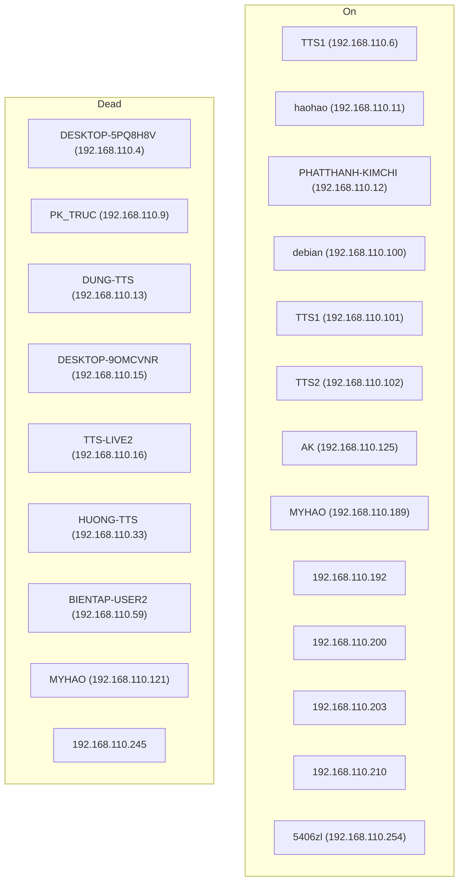

Để cập nhật dữ liệu cho cột giá trị trong bảng Award mà không làm lỗi cơ sở dữ liệu, chúng ta có thể thực hiện các bước sau:

1. Tạo một migration mới để thêm cột mới (nếu chưa có).
2. Cập nhật dữ liệu cho cột mới.
3. Commit các thay đổi.

Đây là cách thực hiện:

1. Tạo migration mới (nếu cần):

```bash
flask db migrate -m "Add gia_tri column to Award table"
```

2. Kiểm tra file migration được tạo ra trong thư mục `migrations/versions/` để đảm bảo nó chỉ thêm cột mới mà không xóa dữ liệu hiện có.

3. Tạo một script Python riêng để cập nhật dữ liệu. Ví dụ, tạo file `update_award_gia_tri.py`:

```python
from app import app, db
from models import Award

def update_award_gia_tri():
    with app.app_context():
        awards = Award.query.all()
        for award in awards:
            # Cập nhật giá trị tùy theo logic của bạn
            if award.ten_giai == "Giải nhất":
                award.gia_tri = "iPhone 15 Pro Max"
            elif award.ten_giai == "Giải nhì":
                award.gia_tri = "MacBook Air"
            # Thêm các điều kiện khác nếu cần
            
        db.session.commit()
        print("Cập nhật giá trị giải thưởng thành công!")

if __name__ == "__main__":
    update_award_gia_tri()
```

4. Chạy script cập nhật:

```bash
python update_award_gia_tri.py
```

5. Kiểm tra kết quả:

```python
from app import app, db
from models import Award

with app.app_context():
    awards = Award.query.all()
    for award in awards:
        print(f"{award.ten_giai}: {award.gia_tri}")
```

Lưu ý:
- Đảm bảo bạn đã sao lưu cơ sở dữ liệu trước khi thực hiện các thay đổi.
- Nếu bạn đang sử dụng một hệ thống quản lý phiên bản, hãy commit các thay đổi sau khi đã kiểm tra kỹ lưỡng.
- Nếu có nhiều dữ liệu, bạn có thể cân nhắc sử dụng bulk update để tối ưu hiệu suất.

Cách này cho phép bạn cập nhật dữ liệu một cách an toàn mà không ảnh hưởng đến cấu trúc hiện tại của cơ sở dữ liệu hoặc dữ liệu trong các bảng khác.

Mermaid 
